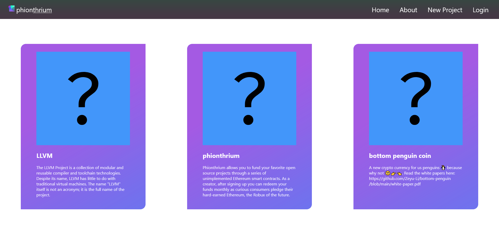
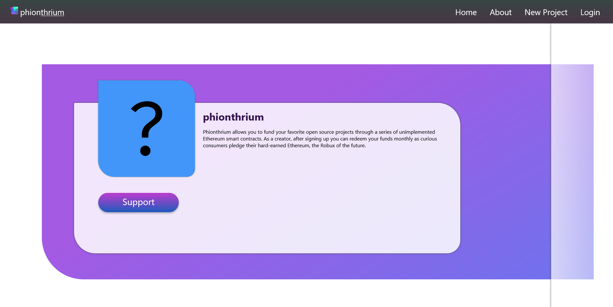

# Phionthrium

[](https://phionthrium.vercel.app/)

[](https://opensource.org/licenses/MIT)

Phionthrium allows you to fund your favorite open source projects through a series of unimplemented Ethereum smart contracts. As a creator, after signing up you can redeem your funds monthly as curious consumers pledge their hard-earned Ethereum, the Robux of the future.

## Screenshots







## Smart Contract/Blockchain

Using [Solana](https://docs.solana.com/) 

Smart contract: https://github.com/KolbyML/Phionthrium/blob/main/contracts/Phionthrium.sol


Dev environment:

```shell
npx hardhat accounts
npx hardhat compile
npx hardhat clean
npx hardhat test
npx hardhat node
node scripts/sample-script.js
npx hardhat help
```

## 

## Backend

Python Flask

using venv `phionthrium\Scripts\activate`

### Dependencies

- Flask

## Front end

A React frontend

[Figma link](https://www.figma.com/file/AvHAIEKiN7gMtnP1KvzkJO/Crypto-Bros?node-id=0%3A1)

### Dependencies

- React

## Team 👨‍👨‍👦‍👦

- [Ben Wang](https://github.com/Xiaoyu-Ben-Wang)
- [Andrew Li](https://github.com/Zeyu-Li)
- [Dan](https://github.com/seliayeu)
- [Kolby ML](https://github.com/KolbyML)

## License

[](https://opensource.org/licenses/MIT)